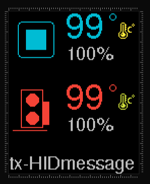
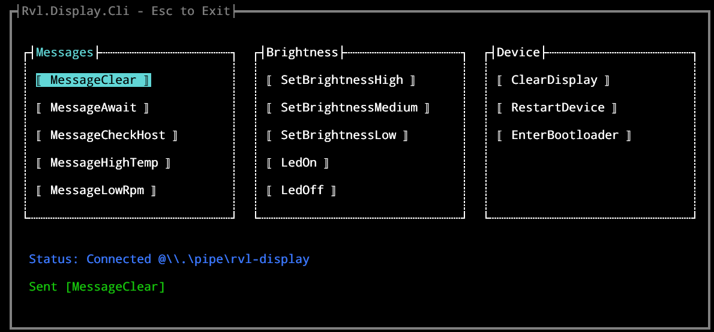

# rvl-display

a custom hardware to monitor system sensors via 1.8" TFT LCD, powered by a Raspberry Pi Pico and communicating with a host application via USB HID.

## Hardware

- **Controller**: Raspberry Pi Pico Zero ([RP2040-zero](./docs/rp2040-zero.png)).
- **Display**: 1.8" 128x160 TFT LCD ([ST7735S](./docs/st7735s.png)).
- **Connection**: Direct mainboard USB 9 Pin 2.0 header
- **VID:PID**: `0x5EED:0xFACE` (denolk rvl-display)

## Project Structure

- [rvl.host/](rvl.host/): C# .NET solution for host-side applications.
  - [rvl.host/Cli/](rvl.host/Cli/): Command-line interface for manual control and testing.

  - [rvl.host/Core/](rvl.host/Core/): Shared logic between host applications.

### rvl.display firmware

- [rvl.device.fw/](rvl.device.fw/): PlatformIO project for the Raspberry Pi Pico firmware.
- Uses [`main.cpp`](rvl.device.fw/src/main.cpp) for HID communication and display rendering.
- Configuration is defined in [`platformio.ini`](rvl.device.fw/platformio.ini).
- UI layout: https://lopaka.app/gallery/28702/59717
- 

### rvl.host.service windows service

- [rvl.host/Service/](rvl.host/Service/): Windows Service that runs in the background to stream sensor data.
- Communicates with the device via USB HID and exposes a netpipe for cli app.
- Uses `LibreHardwareMonitor` to read system sensors and sends updates to the device.

### rvl.host.cli command-line interface

- [rvl.host/Cli/](rvl.host/Cli/): Console application for manual control and testing.
- Connects to the service's netpipe to send commands and receive status updates.
- Provides a simple tui for interacting with the device
- 

### TODO

- [ ] add cpu, gpu fan sensors
- [ ] display temp colors based on thresholds
- [ ] 3D print a custom case
- [ ] spi dma to lcd
- [ ] sprite rendering for lcd
